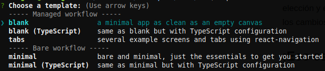

  

<h1 align="center">React Native</h1>

## Quick start

Warning sudo permits :warning:

- Install [Explo CLI](https://docs.expo.io/versions/latest/workflow/expo-cli/) for easy technology startup -> `npm install -g expo-cli` : expo-cli@3.13.1
- Create the project -> `expo init NameProject --npm` : react native project
- Choose a template -> `Managed workflow > blank`

- Start the project -> `npm run start` or `expo start` : application execution
- Download the [Expo](https://play.google.com/store/apps/details?id=host.exp.exponent) application on Android or iOS : Expo application

## Creator

### Alejandro Torres

- <https://codepen.io/aresigner/>
- <https://github.com/aresigner/>

### Carlos Llerandi

- <https://github.com/cllendi/>

## Copyright and license

Code and documentation copyright 2019 the [Ceres Authors](https://github.com/aresigner). Code released under the [MIT License](https://github.com/twbs/bootstrap/blob/master/LICENSE). Docs released under [Creative Commons](https://github.com/twbs/bootstrap/blob/master/docs/LICENSE).
